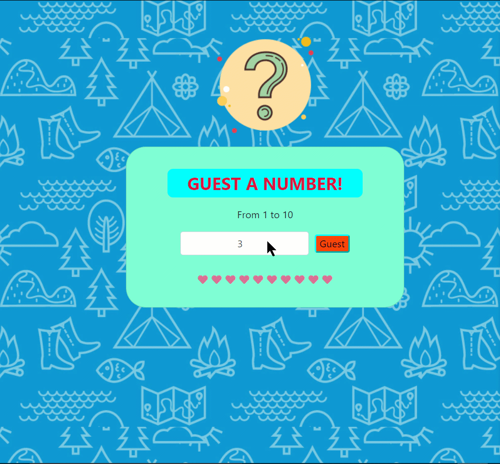
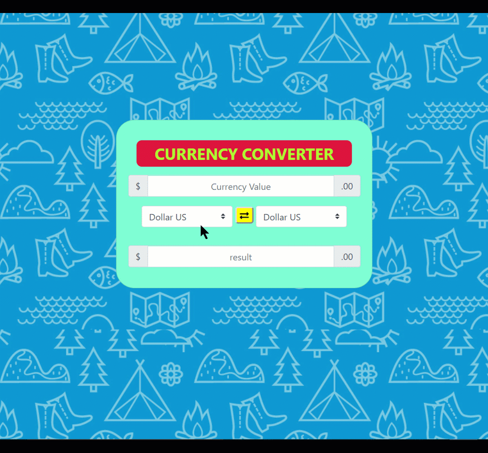
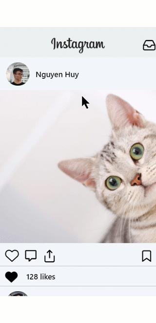

# **dev-c challenge - with coderschool**

<div" style="width:100%">

 <h2><i>week 1</i></h2>
 <table style="width:100%">
<tr>
    <th> 

       
       
guess game

    
 </th>
    <th> 

       
       
Currency converter

    
 </th>
</tr>
</table>

 <h2><i>week 2</i></h2>
 <table style="width:100%">
<tr>
    <th> 

       
       
guess game

    
 </th>
    <th> 

       
       
Currency converter

    
 </th>
</tr>
</table>

